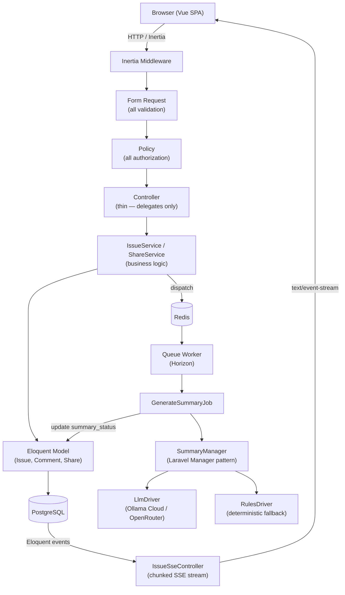
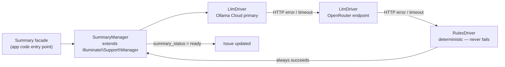

# Issue Intake & Smart Summary System

An issue intake + AI summary system for support/operations teams. Laravel 13 +
Inertia + Vue 3 + PostgreSQL + Redis + Horizon, fully containerized via
**Laravel Sail**.

> **Live demo:** sts-demo.betamaxgroup.tech

---

## Key Features

- **Kanban dashboard** — drag-and-drop issue cards between status columns; all CRUD via modals, no page reloads
- **Async AI summary pipeline** — 3-tier fallback: Ollama Cloud → OpenRouter → rules-based engine (SPEC §5, ADR-002)
- **SSE real-time updates** — every open browser tab receives live issue changes via Server-Sent Events without polling
- **Google Docs-style sharing** — ladderized `view → comment → edit` permissions per issue, independent of visibility (ADR-007)
- **Optimistic locking** — `lock_version` on the issues model prevents lost-update conflicts on concurrent edits
- **Deadline + needs_attention auto-flagging** — computed automatically from priority (high/critical) or deadline proximity (ADR-005)

---

## Project Overview

This project is a **single-user-multi-issue intake tracker** for support and operations teams. Users log issues, attach priorities and deadlines, and the system automatically generates a plain-English summary of each issue using a multi-driver AI pipeline. Issues are managed on a Kanban board and can be shared granularly with teammates.

**What makes it interesting architecturally:**
- The AI pipeline uses the Laravel Manager/Strategy pattern for pluggable, testable LLM drivers — the same pattern Laravel uses for queues, caches, and mail
- Real-time updates use native PHP SSE (no WebSocket server, no pusher dependency)
- The entire stack runs in Docker via Sail with a single `make dev` command

---

## Tech Stack

| Layer | Choice |
|---|---|
| Backend | Laravel 13 (PHP 8.4) |
| Frontend | Inertia.js + Vue 3 + TypeScript |
| UI Kit | shadcn-vue + Tailwind CSS v4 |
| Database | PostgreSQL 18 |
| Queue | Redis + Laravel Horizon |
| AI | Ollama Cloud (primary), OpenRouter (backup), rules-based fallback |
| Real-time | SSE (Server-Sent Events) |
| Auth | Laravel Breeze, session-based |
| Testing | PHPUnit 12 — 283 tests, 649 assertions |
| Drag & Drop | vue-draggable-plus |
| Container | Laravel Sail (Docker Compose) |

---

## TL;DR — Daily Workflow

```bash
make dev       # start everything (containers + vite + queue), idempotent
make status    # verify all services are healthy
make logs      # tail vite + queue logs
make test      # run the full PHPUnit suite
make down      # stop everything when you're done for the day
```

That's it. Every other command is also a `make` target — run `make` alone
to see all of them.

---

## Why Make + Sail (and not bare commands)

| Concern | Solution |
|---|---|
| Host PHP is 8.1; the app needs PHP 8.4 | Everything runs inside the Sail container — host PHP is never invoked |
| Composer's built-in `dev` script collides with Sail's nginx on port 80 | Replaced by `make dev`, which starts only what Sail doesn't already provide |
| Vite must run *alongside* Sail (not replace it) on port 5175 | `make vite` starts it in the background inside the container with logging |
| Queue worker must be running for `GenerateSummaryJob` to fire | `make queue` runs `queue:work` in the background |
| Agents need to verify dev state cheaply | `make status` is a single command, parseable output |

**Rule:** never run bare `php`, `composer`, `npm`, `npx`, or `vue-tsc` on the
host. Always use `make <target>` or `./vendor/bin/sail <command>`.

---

## Architecture Overview

The request flow, service layer, async pipeline, and SSE channel in one diagram:



### Ports (on the host)

| Service | Host port | Notes |
|---|---|---|
| Laravel app | **80** | http://localhost |
| Vite (HMR) | **5175** | Background; you don't visit this directly |
| PostgreSQL | **5434** | mapped from container's 5432; override via `FORWARD_DB_PORT` |
| Redis | **6379** | |

---

## AI Summary Pipeline

The AI pipeline uses the **Laravel Manager + Strategy** pattern. `SummaryManager` resolves a driver from config and calls a common `SummaryGeneratorInterface`. Failure at any level falls through to the next:



**Driver resolution** is config-driven (`config/summary.php`). The `LlmDriver` itself supports multiple endpoint URLs — Ollama Cloud and OpenRouter are configured as primary/backup within the same driver class. `RulesDriver` is the final catch-all and never throws.

See **ADR-002** for the full rationale.

---

## First-Time Setup

```bash
git clone <repo>
cd ticketing-system
make setup    # composer install, npm install, .env, key:generate, migrate
make fresh    # seed the database with demo data (see "Try It Locally" below)
make dev      # start everything
```

If Boost MCP errors during agent sessions, that means Sail isn't up. Run
`make up` first.

---

## Try It Locally

Once `make dev` reports all green, open http://localhost in the browser.

### Seeded credentials

Run `make fresh` (or `make seed` against an empty DB) to populate the demo
dataset. All seeded users share the password **`password`**:

| Email | Name | Use for |
|---|---|---|
| `demo@example.com` | Demo User | Quick "happy path" tour — owns several issues |
| `alice@example.com` | Alice Johnson | Second user — try sharing issues to her |
| `bob@example.com` | Bob Martinez | Third user — comments visible across shared issues |
| `carol@example.com` | Carol Chen | |
| `david@example.com` | David Kim | |

> Demo users are idempotent — re-running `make seed` won't duplicate them.

### What you get from the seed

- **6 categories**: billing, technical, account, general, bug, feature-request
- **~18 issues** spanning all priorities (low → critical), all statuses
  (open, in_progress, resolved, closed), and a mix of public/private visibility
- **≥2 issues with a ready AI summary** (pre-filled — you can see what the
  summary panel looks like without waiting for the AI to generate one)
- **≥3 issues flagged `needs_attention`** (critical priority or near deadline)
- **~30 comments** spread across issues
- **2-3 issues shared between users** with different permission levels
  (view / comment / edit)

### Suggested first tour (≈ 3 min)

1. **Log in** at http://localhost/login as `demo@example.com` / `password`
2. **Dashboard** loads the Kanban board (ADR-003 — dashboard-first design).
   You should see issues bucketed into columns by status.
3. **Click an issue card** → opens the detail modal (URL updates to
   `?issue=<id>` so it's deep-linkable and back-button-safe).
4. **Drag a card** between columns to change its status. The change
   persists; refreshing the page keeps the new column.
5. **Create an issue** — click the new-issue button, fill the form,
   submit. Watch the queue worker (`make logs`) pick up the
   `GenerateSummaryJob` and populate the summary asynchronously.
6. **Edit the description** of an existing issue. Per SPEC §5.3, this
   re-triggers summary generation — observe the badge change from
   `ready` → `generating` → `ready` again.
7. **Share an issue**: from an issue you own, share it with
   `alice@example.com` at `comment` permission. Log out, log in as Alice
   (`alice@example.com` / `password`), and verify the issue appears in
   her dashboard with a comment box (but no edit button).

### Resetting the demo

```bash
make fresh    # drops all tables, re-migrates, re-seeds — destructive
```

This is safe to run repeatedly. `make fresh` runs inside a DB transaction,
so a failed seed leaves the DB intact.

---

## API Endpoints

All application routes are under `/api/`. Auth and profile routes are standard Laravel Breeze and excluded below.

| Method | URI | Route Name | Controller |
|---|---|---|---|
| GET | `/api/categories` | `categories.index` | `CategoryController@index` |
| POST | `/api/categories` | `categories.store` | `CategoryController@store` |
| DELETE | `/api/categories/{category}` | `categories.destroy` | `CategoryController@destroy` |
| GET | `/api/issues` | `issues.index` | `IssueController@index` |
| POST | `/api/issues` | `issues.store` | `IssueController@store` |
| GET | `/api/issues/{issue}` | `issues.show` | `IssueController@show` |
| PUT/PATCH | `/api/issues/{issue}` | `issues.update` | `IssueController@update` |
| DELETE | `/api/issues/{issue}` | `issues.destroy` | `IssueController@destroy` |
| POST | `/api/issues/{issue}/comments` | — | `CommentController@store` |
| GET | `/api/issues/{issue}/shares` | `issues.shares.index` | `ShareController@index` |
| POST | `/api/issues/{issue}/shares` | `issues.shares.store` | `ShareController@store` |
| GET | `/api/issues/{issue}/stream` | — | `IssueSseController` (SSE) |
| GET | `/api/shares/{share}` | `shares.show` | `ShareController@show` |
| PUT/PATCH | `/api/shares/{share}` | `shares.update` | `ShareController@update` |
| DELETE | `/api/shares/{share}` | `shares.destroy` | `ShareController@destroy` |

All write endpoints require authentication and pass through a `Policy` before reaching the controller. Validation lives in a `FormRequest` class per endpoint — never inline in the controller.

The SSE endpoint (`/api/issues/{issue}/stream`) returns `Content-Type: text/event-stream` and streams real-time updates to the browser as long as the connection stays open.

---

## Testing

### Running the suite

```bash
make test                                  # full PHPUnit 12 suite
make test-filter FILTER=IssuePolicyTest    # one test class
make test-filter FILTER=test_status_change # one method (substring)
```

Tests use `RefreshDatabase`, so they don't touch the seeded demo data —
you can run tests and keep using the live app at http://localhost.

### What's covered

**283 tests, 649 assertions** across three layers (PHPUnit 12, not Pest):

| Layer | Count | What it tests |
|---|---|---|
| Integration | ~35 | Cross-layer regression: a request travels through FormRequest → Policy → Controller → Service → Model and verifies the DB state |
| Feature | ~45 | HTTP endpoint behavior, validation errors, auth gates, status codes |
| Unit | ~20 | Isolated logic: SummaryManager driver resolution, RulesDriver output, `needs_attention` computation, lock_version conflict detection |

### Common scenarios to try after the first tour

| Scenario | Expected behavior | SRS reference |
|---|---|---|
| Create issue with `priority=critical` | `needs_attention=true` set automatically by the `Issue::saving` event | SPEC §4.2 |
| Set `deadline_at` to within 48h | `needs_attention=true` regardless of priority | SPEC §4.2 |
| Change an issue's `status` only | summary is **not** re-generated | SPEC §5.3 |
| Change an issue's `description` | summary **is** re-generated, status goes `ready → generating → ready` | SPEC §5.3 |
| Try to view a private issue you don't own and aren't shared with | 403 | SPEC §3.2 |
| Try to comment on a public issue you aren't shared with at `comment` level | 403 (public = view-only without explicit share) | SPEC §3.2 |
| Take Ollama offline, then create an issue | Summary falls back to OpenRouter, then to rules-based; `summary_status` reflects which driver succeeded | ADR-002 |

---

## Design Decisions (ADRs)

Ten Architecture Decision Records live in [`vault/docs/adr/`](vault/docs/adr/). Each is a short Markdown file with Status, Context, Decision, and Rationale.

| ADR | Title | Decision |
|---|---|---|
| [ADR-001](vault/docs/adr/001-stack-selection.md) | Stack Selection | Laravel 13 + Inertia + Vue 3 + TypeScript + shadcn-vue + Tailwind CSS v4 + PostgreSQL + Redis |
| [ADR-002](vault/docs/adr/002-ai-architecture.md) | AI / Summary Generation Architecture | Laravel Manager + Strategy pattern; two drivers (`LlmDriver`, `RulesDriver`) behind a single `SummaryGeneratorInterface`; 3-tier fallback |
| [ADR-003](vault/docs/adr/003-dashboard-first-kanban.md) | Dashboard-First Kanban UI | The dashboard IS the app — Kanban columns = statuses, all CRUD via modals/drag-and-drop, no separate list view |
| [ADR-004](vault/docs/adr/004-auth-model.md) | Authentication Model | Free-tier SaaS model — no roles, per-issue ownership + sharing; ladderized `view → comment → edit` permissions |
| [ADR-005](vault/docs/adr/005-priority-vs-deadline.md) | Priority and Deadline as Independent Dimensions | `priority` and `deadline_at` are orthogonal fields; `needs_attention` computed from either (high/critical OR within 48h of deadline) |
| [ADR-006](vault/docs/adr/006-category-model.md) | Dynamic DB-Backed Categories | DB-backed `categories` table with seeded defaults and inline creation; not an enum |
| [ADR-007](vault/docs/adr/007-sharing-and-visibility.md) | Issue Sharing & Visibility Model | Binary `visibility` (private/public) + explicit permission grants via `shares` table; sharing works the same on both visibility levels |
| [ADR-008](vault/docs/adr/008-docker-deployment.md) | Docker Compose Deployment Strategy | Simple Docker Compose with generic images and source-mounted volumes; no custom Dockerfile builds; Caddy as reverse proxy |
| [ADR-009](vault/docs/adr/009-testing-strategy.md) | Integration-First Testing Strategy | Integration tests are the primary regression firewall; feature tests cover endpoints; unit tests cover isolated logic |
| [ADR-010](vault/docs/adr/010-sprint-workflow.md) | Sprint-as-Deployable-Unit Workflow | Sprint = logical deployable capability (not time-box); tasks numbered `XX.XX.XX`; filesystem sort is execution order |

---

## Deployment

Production deployment uses `docker-compose.prod.yml` with Caddy as the reverse proxy and SSL termination. See **ADR-008** for the full rationale.

### Quick production deploy

```bash
# On the target host (192.168.254.140 or equivalent)
git clone <repo> ticketing-system
cd ticketing-system
cp .env.example .env.prod
# Edit .env.prod: set APP_KEY, DB_PASSWORD, OLLAMA_URL, OPENROUTER_API_KEY, etc.
docker compose -f docker-compose.prod.yml up -d
docker compose -f docker-compose.prod.yml exec app php artisan migrate --force
docker compose -f docker-compose.prod.yml exec app php artisan db:seed --force
```

### Production services

| Service | Image | Purpose |
|---|---|---|
| `app` | Generic PHP 8.4 + Node | Laravel app + Vite build |
| `horizon` | Same as app | Queue worker (Horizon) |
| `scheduler` | Same as app | `schedule:run` loop |
| `postgres` | postgres:16-alpine | Database |
| `redis` | redis:7-alpine | Queue + cache |
| `caddy` | caddy:2-alpine | Reverse proxy + automatic TLS |

> **Note:** `make` targets are for the Sail dev environment only. Use `docker compose -f docker-compose.prod.yml exec app php artisan ...` for production operations.

---

## Screenshots

> *(Task 05.04 handles final screenshot capture and verification. Placeholder paths are reserved below.)*

| Screen | Path |
|---|---|
| Kanban dashboard — light mode | `docs/screenshots/dashboard-light.png` |
| Kanban dashboard — dark mode | `docs/screenshots/dashboard-dark.png` |
| Issue detail modal | `docs/screenshots/issue-detail.png` |
| Share dialog | `docs/screenshots/share-dialog.png` |

---

## Project Layout

```
.
├── app/                       # PHP source (coder-backend's domain)
│   ├── Enums/                 # Priority, Status, Visibility, Permission, SummaryStatus
│   ├── Http/                  # Controllers, Form Requests, Middleware
│   ├── Models/                # Eloquent models
│   ├── Policies/              # Authorization (ladderized SPEC §3.2)
│   ├── Services/              # Business logic, including Summary/ drivers
│   │   └── Summary/           # SummaryManager, LlmDriver, RulesDriver
│   └── Jobs/                  # Async work (GenerateSummaryJob)
├── resources/
│   ├── js/                    # Vue + Inertia (coder-frontend's domain)
│   │   ├── Pages/             # Inertia pages
│   │   ├── Components/        # Vue components (ui/ added on demand via shadcn-vue CLI)
│   │   ├── Layouts/           # AuthenticatedLayout etc.
│   │   ├── Types/             # Shared TypeScript interfaces (created on demand)
│   │   └── composables/       # Vue composables (SSE, etc.)
│   └── css/app.css            # Tailwind v4 + theme tokens
├── database/
│   ├── migrations/            # Schema (coder-backend)
│   ├── factories/             # Test fixtures (QA agent owns these)
│   └── seeders/               # Demo data (coder-backend)
├── tests/                     # PHPUnit 12 (QA agent's domain)
│   ├── Feature/               # Integration + HTTP tests
│   └── Unit/                  # Pure logic
├── docker-compose.prod.yml    # Production deployment (ADR-008)
├── vault/                     # Living docs (single source of truth)
│   ├── SPEC.md                # What to build
│   ├── docs/SRS.md            # How to build it (scenarios I-XX)
│   ├── docs/adr/              # Decision records (why)
│   └── sprint/                # Task management — PLAN.md, backlog/, ongoing/, done/
├── .opencode/agents/          # Project-specific AI agents
├── Makefile                   # All dev workflow commands (this file's bff)
└── AGENTS.md                  # Conventions agents must follow
```

---

## AI-Driven Development

This project uses [OpenCode](https://opencode.ai) with four project-specific agents:

| Agent | Role |
|---|---|
| `tech-lead` | Task enrichment + code review (no code) |
| `qa` | Red-phase test writing + verification (no app code) |
| `coder-backend` | Laravel implementation (no frontend) |
| `coder-frontend` | Vue + Inertia implementation (no PHP) |

Each agent is designed using the 5-phase Agent Design Protocol (see
`.opencode/agents/*.md` and `vault/SPEC.md`). The workflow per task:

```
tech-lead (enrich)
    ↓
qa (RED tests)
    ↓
coder-backend → coder-frontend
    ↓
qa (VERIFY — full suite green)
    ↓
tech-lead (REVIEW — APPROVED or CHANGES_REQUIRED)
    ↓
merge to dev
```

Boost MCP and `@henkey/postgres-mcp-server` are configured in `opencode.json`
and require `make up` to be running.

---

## Common Tasks

```bash
# Iteration
make dev                                # start dev environment
make status                             # is it still working?
make logs                               # what's vite/queue saying?

# Tests
make test                               # full suite
make test-filter FILTER=CreateIssueTest # one class

# Code quality
make pint                               # auto-fix formatting
make pint-check                         # CI-style check, no fix

# Database
make fresh                              # drop, re-migrate, seed (destructive)
make migrate                            # apply pending migrations only
make seed                               # add seed data to current DB

# Ad-hoc
make tinker                             # PHP REPL
make shell                              # bash inside the container
```

---

## When Things Break

| Symptom | Likely cause | Fix |
|---|---|---|
| `make dev` says container is up but http://localhost gives connection refused | Stale containers from a previous broken state | `make down && make dev` |
| Vite changes don't appear in browser | Vite died silently | `make status` then `make vite` to restart |
| Test suite hangs | Queue worker holding a Postgres connection | `make queue-stop && make test` |
| Boost MCP errors in agent session | Sail isn't running | `make up` |
| `composer run dev` doesn't work | It's a non-Sail script; ignore it | Use `make dev` |
| `php artisan ...` fails on host | Host PHP is 8.1, app needs 8.4 | Use `make` targets or `./vendor/bin/sail artisan ...` |

---

## Documentation

- **`vault/SPEC.md`** — product specification
- **`vault/docs/SRS.md`** — software requirements with scenarios
- **`vault/docs/adr/`** — architecture decision records (10 ADRs)
- **`vault/sprint/PLAN.md`** — current sprint state
- **`AGENTS.md`** — conventions for AI agents (and humans)
