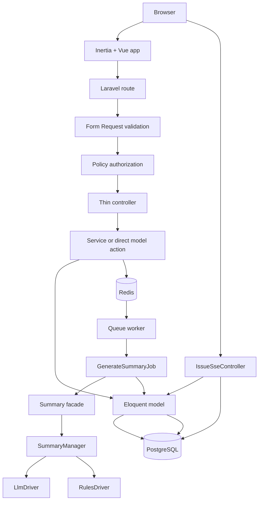

# Technical Assessment Course

> Purpose: this is a study guide for explaining, defending, and demoing the project in a technical assessment.
>
> Source of truth: if this file, `README.md`, `vault/SPEC.md`, and the code disagree, trust the code first, then the ADRs, then the SRS.

---

## 1. How To Use This Course

Read this in three passes:

1. First pass: learn the elevator pitch, architecture, and stack choices.
2. Second pass: learn the concrete code seams so you can answer "where is that implemented?"
3. Third pass: rehearse the demo script and interview-defense Q&A.

If you are short on time, master these sections first:

- `2. Project In One Minute`
- `3. What The System Does`
- `4. Architecture At A Glance`
- `5. Technology Stack`
- `11. Design Patterns Used`
- `14. Interview Defense Q&A`
- `15. Demo Script`

---

## 2. Project In One Minute

### 30-second version

This project is an issue intake and smart summary system for support and operations teams. Users create issues, manage them on a Kanban dashboard, collaborate with comments and per-issue sharing, and get AI-generated summaries asynchronously. The backend is Laravel, the frontend is Inertia plus Vue 3, the database is PostgreSQL, the queue uses Redis plus Horizon, and live summary updates use Server-Sent Events.

### 90-second version

The app is intentionally dashboard-first. Instead of building a classic CRUD app with separate list, show, edit, and create pages, the main experience is a Kanban board where users can create issues in a modal, open a detail slide-over, drag cards between status columns, and see summary generation complete in real time.

Architecturally, the interesting part is the AI summary subsystem. It uses a Laravel-style Manager pattern with pluggable drivers behind a single contract. The system can call a configured OpenAI-compatible LLM endpoint, but if that fails or no API key is present, it falls back to a deterministic rules-based driver so the app still works locally and in the assessment.

The codebase is also disciplined about validation, authorization, concurrency, and testing. Validation lives in Form Request classes, authorization lives in Policies, business logic is pulled into services when it is non-trivial, optimistic locking uses `updated_at`, and the project currently passes `283` PHPUnit tests plus the Playwright smoke gate.

---

## 3. What The System Does

### Core user flows

1. A user registers or logs in.
2. The user lands on the dashboard Kanban board.
3. The user creates an issue with title, description, priority, category, optional visibility, and optional deadline.
4. The backend stores the issue and dispatches `GenerateSummaryJob`.
5. The queue worker processes the job and writes a summary plus suggested next action.
6. The browser listens on an SSE stream and updates the issue when the summary becomes ready or failed.
7. Users can comment, share the issue, or move it between `open`, `in_progress`, and `resolved`.

### Main business rules

- Issue ownership matters: owners have full control.
- Sharing is ladderized: `view -> comment -> edit`.
- Public issues are viewable by any authenticated user.
- Private issues are only visible to the owner and explicitly shared users.
- `description` changes re-trigger summary generation.
- `status` changes do not re-trigger summary generation.
- `needs_attention` is true if priority is `high` or `critical`, or if the deadline is close/passed.
- Concurrent updates are protected with optimistic locking using `updated_at`.

### Interview-safe product framing

If asked what kind of product this is, say:

"It is a lightweight collaborative support-operations tracker with AI-assisted triage. The focus is not enterprise ticketing breadth. The focus is clean architecture, async processing, real-time feedback, and a polished operator workflow on a constrained assessment scope."

---

## 4. Architecture At A Glance



### Backend request path

The backend follows a clean Laravel layering style:

- Routes live in `routes/api.php` and `routes/web.php`.
- Validation lives in `app/Http/Requests/*`.
- Authorization lives in `app/Policies/*`.
- Controllers stay thin in `app/Http/Controllers/*`.
- Non-trivial issue logic lives in `app/Services/IssueService.php`.
- Persistence and reusable query logic live in Eloquent models such as `app/Models/Issue.php`.
- API response shaping lives in `app/Http/Resources/IssueResource.php`.

### Frontend interaction path

The frontend is a Vue application mounted through Inertia:

- Entry point: `resources/js/app.ts`
- Dashboard page: `resources/js/Pages/Dashboard.vue`
- Application shell: `resources/js/Layouts/AppLayout.vue`
- Board state: `resources/js/composables/useKanbanBoard.ts`
- Detail state: `resources/js/composables/useIssueDetail.ts`
- Live summary stream: `resources/js/composables/useSummaryStream.ts`

### Async AI path

The AI summary flow is the most important architecture seam:

1. `IssueService::create()` dispatches `GenerateSummaryJob`.
2. `GenerateSummaryJob` marks the issue as `processing`.
3. The job calls the `Summary` facade.
4. The facade resolves `SummaryManager`.
5. `SummaryManager` resolves the configured driver.
6. The chosen driver returns a `SummaryResult` value object.
7. The job persists the result and fires `SummaryCompleted`.

### Real-time update path

The UI does not wait on long polling for the main happy path.

- Browser opens `GET /api/issues/{id}/stream`.
- `IssueSseController` streams until the issue reaches `ready` or `failed`.
- Frontend `useSummaryStream.ts` listens for `summary.ready` and `summary.failed`.
- If SSE repeatedly errors, the composable falls back to polling `GET /api/issues/{id}`.

That fallback is a strong interview point: the system is resilient even when the live stream is unstable.

---

## 5. Technology Stack

| Layer | What it is | Where used | Why we chose it | Notable alternatives and why not |
| --- | --- | --- | --- | --- |
| Laravel 13 | Full-stack PHP framework | Entire backend | Fast delivery, strong conventions, queues, policies, validation, Eloquent, Horizon | Symfony: more explicit but heavier for this scope. NestJS/Express: valid, but the assessment leans Laravel/PHP. |
| Inertia.js | Bridge between Laravel routes/controllers and a Vue SPA | Web app delivery | SPA feel without building a separate API-auth frontend stack | Separate REST API + SPA: more flexible but more boilerplate. Livewire: simpler server-driven UI, but this assessment benefits from richer client interactions. |
| Vue 3 | Frontend framework | `resources/js` | Fast to build with, strong Composition API ergonomics, common Inertia pairing | React: also valid, but Vue is quicker for this project size and interaction density. |
| TypeScript | Static typing for frontend code | Vue components/composables | Safer contracts, especially around API resource shapes and board state | Plain JS: faster at first, but easier to regress during AI-assisted or concurrent editing. |
| Tailwind CSS v4 | Utility-first CSS system | `resources/css/app.css`, UI components | Fast implementation, theming via tokens, easy consistency | Plain CSS/SCSS: more manual repetition. Bootstrap: faster defaults but less tailored. |
| shadcn-vue | Reusable headless-ish UI component system for Vue | `resources/js/components/ui` | Good primitives, design-system-friendly, pairs well with Tailwind | PrimeVue: faster but more opinionated and heavier. |
| PostgreSQL | Relational database | Main persistence | Strong relational integrity, good concurrency behavior, production-friendly | SQLite: simpler but weaker concurrency and less production parity. MySQL: also valid, but Postgres is a strong default for relational apps with future growth. |
| Redis | In-memory data store | Queue backend and Horizon | Fast queue transport, standard Laravel pairing, good async support | Database queue: simpler infra, but poorer observability and weaker async story. |
| Laravel Horizon | Queue dashboard and worker tooling | `/horizon`, queue monitoring | Lets you explain job health, retries, and failures clearly | Raw `queue:work` alone: works, but no monitoring UI. |
| Server-Sent Events | One-way server-to-browser streaming | `IssueSseController`, `useSummaryStream.ts` | Simpler than WebSockets for one-way summary completion events | WebSockets/Reverb/Pusher: better for two-way collaboration, but overkill here. |
| Laravel Breeze | Auth starter kit | Auth routes/controllers/views | Good fit for session-based same-origin auth with Inertia | Sanctum tokens or JWT: unnecessary when the browser and backend are same-origin. |
| PHPUnit 12 | Test framework | `tests/Feature`, `tests/Unit` | Explicit, class-based, matches project rules, stable for AI-generated tests | Pest: great syntax, but the current codebase standardized on PHPUnit. |
| Playwright | Browser smoke testing | `tests/Playwright/smoke.spec.ts` | Verifies real browser rendering and JS/runtime health | Cypress: also valid, but Playwright is fast and scriptable for smoke coverage. |
| Laravel Sail | Docker-based local dev wrapper | `compose.yaml`, `Makefile` | Keeps PHP/Node execution inside containers, avoids host drift | Bare host tooling: faster on one machine, but harder to keep deterministic. |

### Interview-safe summary of the stack choice

"We optimized for fast, reliable delivery in a Laravel-native ecosystem. The stack is cohesive: Laravel handles validation, policies, queues, scheduling, and auth; Inertia and Vue give us SPA UX without API duplication; Postgres and Redis give us production-grade persistence and async processing; and SSE gives us real-time behavior without WebSocket overhead."

---

## 6. Backend Architecture In Detail

### Controllers are intentionally thin

Examples:

- `app/Http/Controllers/IssueController.php`
- `app/Http/Controllers/CommentController.php`
- `app/Http/Controllers/CategoryController.php`
- `app/Http/Controllers/ShareController.php`

What that means:

- Controllers do not contain validation rules.
- Controllers do not contain authorization logic details.
- Controllers do not contain large business workflows.
- Controllers mostly orchestrate request -> authorize -> delegate -> return resource.

Why this matters:

- Easier to test.
- Easier to reason about.
- Easier to swap internal implementations without changing the endpoint contract.

### Validation is centralized in Form Requests

Examples:

- `StoreIssueRequest`
- `UpdateIssueRequest`
- `StoreCommentRequest`
- `StoreShareRequest`
- `UpdateShareRequest`

Why this is good:

- Keeps validation out of controllers.
- Makes business rules explicit and discoverable.
- Makes the request contract easy to explain in an interview.

Good example: `UpdateIssueRequest` requires `updated_at` on PATCH requests so optimistic locking is enforced at the API boundary.

### Authorization is centralized in Policies

Examples:

- `app/Policies/IssuePolicy.php`
- `app/Policies/CommentPolicy.php`

Why this is good:

- Authorization logic is not duplicated across endpoints.
- The permission ladder is encoded once.
- Controllers stay declarative with `$this->authorize(...)`.

Interview-safe phrasing:

"I used policies because authorization is a domain rule, not a controller concern. The controller should ask 'may this user do this?' but not decide how that answer is computed."

### Business logic lives in services when it is non-trivial

Primary example:

- `app/Services/IssueService.php`

What it owns:

- Issue creation defaults
- Summary job dispatch
- Optimistic locking behavior
- Description-change side effects
- Soft deletion orchestration

Why not make everything a service:

- Small, direct operations such as category creation or comment creation stay in controllers because adding a service layer there would be ceremony without value.
- This is a good sign of pragmatism rather than dogma.

### Models do more than persistence

Primary example:

- `app/Models/Issue.php`

The `Issue` model contains:

- enum casting
- the `saving` model event that computes `needs_attention`
- query scopes for filtering by status, priority, category, and accessibility
- relationship definitions

This is a strong Laravel-native choice. The model owns domain-adjacent persistence logic, while broader workflows stay in services.

### API responses are explicitly shaped

Primary example:

- `app/Http/Resources/IssueResource.php`

Why this matters:

- The frontend gets a stable JSON contract.
- The list view and detail view can expose slightly different fields without changing the model.
- Permissions are exposed as a structured `can` map rather than inferred by the client.

#### The `can` permissions map

`IssueResource` returns a `can` key containing a map of permission booleans:

```php
'can' => [
    'view'    => $user->can('view', $issue),
    'update'  => $user->can('update', $issue),
    'comment' => $user->can('comment', $issue),
    'delete'  => $user->can('delete', $issue),
],
```

This replaced individual top-level booleans like `can_comment` and `can_update`.

Why this is better:

- Single source of truth for all permissions on each issue.
- Extensible: adding a new permission is one line, not a new top-level key.
- Structured: the frontend can type it as `Record<Permission, boolean>` and iterate over it.
- Mirrors the `Permission` enum on the backend.

**NestJS comparison:** In NestJS you would typically decorate a DTO with a permissions object assembled inside an interceptor or serializer. The Laravel equivalent is computing it inside the Resource class, which is the response transformer layer. Both approaches keep permission computation out of the controller and close to serialization.

---

## 7. Frontend Architecture In Detail

### Why this is not a classic CRUD frontend

The product deliberately avoids a page-per-action CRUD flow.

Instead:

- the dashboard is the main workspace
- creation is modal-driven
- issue detail is a slide-over
- status changes happen via drag and drop
- real-time updates happen inside the detail view

This is a better operator workflow because the user keeps context while moving through the system.

### Inertia page model

Key files:

- `resources/js/app.ts`
- `resources/js/Pages/Dashboard.vue`
- `resources/js/Layouts/AppLayout.vue`

Why Inertia works well here:

- Laravel still owns routing and auth.
- Vue owns the client interaction model.
- No duplicated API-auth boilerplate or separate SPA deployment surface.

### Composables are the frontend service layer

Key composables:

- `useKanbanBoard.ts`
- `useIssueDetail.ts`
- `useSummaryStream.ts`
- `useIssueFilters.ts`
- `useIssueShares.ts`
- `useCreateIssue.ts`
- `useCategories.ts`

These composables are important to mention because they are the frontend equivalent of backend services.

What they buy us:

- state logic is reusable and testable
- Vue components stay focused on rendering and event wiring
- asynchronous flows stay isolated

### Board state is intentionally singleton-like

`useKanbanBoard.ts` stores issue columns in module-scoped refs so the board behaves like a shared store without introducing Pinia or Vuex.

Why this is reasonable:

- Only one dashboard board needs to exist at a time.
- It keeps the dependency surface smaller.
- It is enough for assessment scope.

### Optimistic UI is deliberate

Drag and drop moves the card immediately on the client, then PATCHes the server.

If the request fails:

- the move is reverted
- the user gets a contextual toast with title and description (which issue, what went wrong)
- concurrency conflicts show a 409-specific message
- validation failures show a 422-specific message
- permission denials show a 403-specific message linking the user to request access

This is implemented in `resources/js/composables/useKanbanBoard.ts`.

Why it is a strong interview point:

- It shows you thought about perceived performance.
- It shows you thought about rollback on failure, not just happy-path animation.
- It shows you differentiated error types rather than showing a generic "something went wrong."

### Drag authorization is defense-in-depth

Not all users can move all issues. The Kanban board enforces drag authorization at multiple layers:

1. **UI layer:** Cards the user cannot update show a lock icon and are visually muted (0.85 opacity). SortableJS `:filter=".no-drag"` prevents the drag gesture from starting — no server request is made at all.
2. **API layer:** If a drag request somehow reaches the backend, the `IssuePolicy` rejects it with 403.
3. **Feedback layer:** Attempting to drag a locked card shows an info toast: "View-only issue — ask the owner to share it with you." A 403 from the API also shows a permission-denied toast.

This is a textbook defense-in-depth pattern: prevent at the UI, catch at the API, inform the user at both layers.

**NestJS comparison:** In NestJS you would use `@UseGuards(AbilityGuard)` on the endpoint and conditionally disable the drag handle on the frontend based on a permissions DTO. The layers are the same — the difference is that Laravel uses policy method authorization while NestJS uses CASL or a similar ability-check library. The important point is that both the frontend and backend enforce independently.

Why the lock icon is positioned absolutely in the top-right corner of the card:

- It costs zero vertical space in the card layout.
- It is visible without disrupting the card's content hierarchy.
- Muting the entire card at 0.85 opacity provides a secondary signal beyond just the icon.

### Toast UX

Toasts use `vue-sonner` with `vue-sonner/style.css` explicitly imported.

Key details:

- Position: top-right.
- Rich colors: red for errors, green for success.
- Error toasts use a title plus description pattern for context (e.g., title: "Move failed", description: "Issue #42 — another user updated this issue").
- This was a real bug fix: the CSS import was missing so `position` and `rich-colors` props had no effect until the stylesheet was added.

**NestJS comparison:** NestJS frontends typically use `react-hot-toast` or `notistack`. The pattern is the same: a global toast provider with severity-aware styling. The lesson here is that component libraries that require explicit CSS imports can silently degrade — props like `position` and `rich-colors` appear to work (no errors), but the visual behavior is simply absent.

### Follow-up ticket UX

When AI suggests a follow-up ticket, clicking the suggestion now opens the `CreateIssueDialog` pre-filled rather than silently auto-creating the issue.

How it works:

- `CreateIssueDialog` accepts an optional `prefill` prop with `title`, `description`, `priority`, and `category_id`.
- The dialog opens with those fields pre-populated, but the user has full control to review and edit before submitting.

Why this is better than auto-create:

- The user stays in control — they can adjust priority, category, and wording.
- It avoids creating garbage issues from imperfect AI suggestions.
- It feels assistive rather than autonomous.

**NestJS comparison:** This is equivalent to navigating to a create form with query params or passing initial values via a React context/Zustand store. The principle is the same: AI assists, but the user confirms.

### Detail slide-over is also URL-aware

`useIssueDetail.ts` syncs the selected issue into `?issue=<id>`.

Why this matters:

- back button works
- deep-linking works
- the modal-style UX still behaves like a real application state

### Design system and theming

The theme is centrally driven from `resources/css/app.css`.

Important details:

- semantic tokens are mapped with `@theme inline`
- light and dark values live in one place
- primary color is intentionally easy to change
- dark mode is class-based and persisted to local storage through `useDarkMode.ts`

This is a good answer if asked how maintainable the visual system is.

---

## 8. Data Model And Domain Rules

### Core tables

| Table | Purpose | Key reasoning |
| --- | --- | --- |
| `users` | Authenticated users | Standard Laravel user table, no roles |
| `issues` | Core business entity | Holds title, description, priority, status, visibility, deadline, summary fields |
| `categories` | Normalized issue classification | Better than a raw issue string column because it supports filtering, seeding, and admin-like management |
| `comments` | Collaboration thread | Separate table, relational authorship via `user_id` |
| `issue_shares` | Per-issue access control | Encodes `view`, `comment`, `edit` explicitly |

### Why categories are normalized

This is a good design point to defend.

Instead of storing `category` as a free-text column on issues, the project uses a `categories` table with a slug.

Benefits:

- consistent filtering
- no typo drift
- URL-friendly category filters by slug
- user-extensible category set without code changes

### Why sharing is a separate table

The app separates visibility and sharing.

- Visibility answers: "Is this issue public or private by default?"
- Sharing answers: "Which specific user has which extra capability?"

This avoids collapsing multiple concerns into a single field or role system.

### Important enums

Enums live in `app/Enums`:

- `Priority`
- `Status`
- `SummaryStatus`
- `Permission`
- `Visibility`

Why enums are good here:

- fewer stringly-typed bugs
- clearer domain modeling
- validation and casting align with the same value set

### Attention logic

`Issue::computeNeedsAttention()` combines two signals:

- priority signal: high or critical
- deadline signal: within the configured threshold or overdue

This is better than making deadline a proxy for priority because importance and time pressure are separate concerns.

---

## 9. AI Summary Pipeline

### What it is

The AI subsystem generates:

- a short summary
- a suggested next action

It is asynchronous and queue-backed so issue creation stays fast.

### The key seam

Files to know:

- `app/Contracts/SummaryGeneratorInterface.php`
- `app/Facades/Summary.php`
- `app/Services/Summary/SummaryManager.php`
- `app/Services/Summary/Drivers/LlmDriver.php`
- `app/Services/Summary/Drivers/RulesDriver.php`
- `app/Services/Summary/SummaryResult.php`
- `app/Jobs/GenerateSummaryJob.php`

### Why this architecture is good

It cleanly separates:

- calling code from driver resolution
- driver resolution from driver implementation
- remote LLM behavior from local deterministic fallback behavior

That means:

- the app code never cares which provider generated the summary
- new drivers can be added without rewriting controller/service code
- local development works without API keys

### Current real behavior

Current code behavior is:

1. `SummaryManager` uses config to choose a default driver. The default is now `llm` (changed from `rules`).
2. If the configured driver is `llm` but no API key exists, it silently falls back to `rules`.
3. `GenerateSummaryJob` tries the primary driver.
4. If the primary driver fails and retries are exhausted, the job falls back to `rules`.

Interview-safe phrasing:

"The default summary driver is `llm`, which uses a configurable OpenAI-compatible endpoint. If no API key is configured, it auto-falls back to the deterministic `rules` driver so the app always works locally. The LLM driver supports any OpenAI-compatible API including Ollama Cloud and OpenRouter."

### What the LLM prompt includes

The summary prompt is not just title and description — it includes the full comment and conversation history for the issue. This matters because:

- Issues evolve through discussion. A summary based only on the original description misses critical context.
- Comments often contain the real diagnosis, workaround, or decision.
- Re-triggering summary after a description edit now has richer context to work with.

**NestJS comparison:** This is equivalent to building a prompt in a NestJS service by aggregating data from multiple repositories (issue + comments) before calling the LLM SDK. The key principle is the same: assemble context before calling the model, not just the primary entity.

### LLM response parsing: code-fence stripping

Some LLM models wrap their JSON response in markdown code fences like ` ```json ... ``` `. The `LlmDriver` now strips these fences before JSON parsing.

Why this matters:

- Different models have different output formatting habits.
- Without stripping, `json_decode` fails on otherwise valid JSON.
- This is a robustness pattern: normalize model output before parsing, because you cannot control the model's formatting behavior.

### Model suggestions and Ollama Cloud

The system includes a model suggestions endpoint that helps users browse available models.

Key details:

- The endpoint supports a `?preset=` query parameter for pre-save browsing — the user can preview which models are available for a given provider before committing a configuration change.
- Ollama Cloud models are fetched via the `/api/tags` endpoint and mapped to an OpenRouter-compatible shape, so the frontend model picker works uniformly regardless of provider.

### Why not call the LLM directly from the controller

Because that would be bad on multiple levels:

- slower issue creation requests
- poor retry behavior
- tighter coupling to a specific provider
- harder testing
- no clean offline fallback

---

## 10. Real-Time, Concurrency, And Reliability

### SSE instead of WebSockets

The app uses `IssueSseController` plus `useSummaryStream.ts`.

Why SSE is a strong choice here:

- the event flow is one-way only
- browser support is simple
- session-authenticated same-origin SSE is straightforward
- it avoids running a WebSocket server or broker

When WebSockets would be better:

- live collaborative editing
- presence
- typing indicators
- bidirectional frequent updates

### Fallback from SSE to polling

The frontend degrades gracefully.

If SSE errors repeatedly, `useSummaryStream.ts` switches to polling the issue detail endpoint every 10 seconds.

Why that matters:

- the user still gets eventual correctness
- the system remains usable behind imperfect proxies or connections

### Optimistic locking

The backend uses `updated_at` as the concurrency token.

Flow:

1. Client sends `updated_at` with the PATCH.
2. `IssueService::update()` compares it to the DB value.
3. If they differ, the backend returns `409 Conflict`.
4. The frontend re-fetches the fresh issue and surfaces a conflict dialog/toast.

Why this is good:

- prevents silent lost updates
- simpler than pessimistic locking
- good fit for a dashboard app with low write contention

### Queue reliability

`GenerateSummaryJob` is configured with retries and backoff.

- tries: `3`
- backoff: `10`, `30`, `90` seconds

Horizon gives operational visibility into those jobs.

---

## 11. Design Patterns Used

| Pattern | Where | Why it is used |
| --- | --- | --- |
| MVC | Laravel routes/controllers/models/views | Baseline application organization |
| Service Layer | `app/Services/IssueService.php` | Keeps non-trivial workflows out of controllers |
| Policy Pattern | `IssuePolicy`, `CommentPolicy` | Centralizes authorization rules |
| Form Request Pattern | `StoreIssueRequest`, `UpdateIssueRequest`, etc. | Centralizes validation and request normalization |
| Manager Pattern | `SummaryManager extends Manager` | Laravel-native driver resolution for AI providers |
| Strategy Pattern | `LlmDriver` and `RulesDriver` behind `SummaryGeneratorInterface` | Allows pluggable summary generation behavior |
| Facade Pattern | `App\Facades\Summary` | Clean app-facing entry point into the summary subsystem |
| DTO / Value Object | `SummaryResult` | Returns structured summary data without leaking transport details |
| Resource Transformer | `IssueResource` | Stable API response shaping |
| Query Object via Scopes | `Issue::scopeFilterByStatus`, `scopeAccessibleBy`, etc. | Keeps query rules composable and readable |
| Active Record | Eloquent models | Good fit for Laravel and project size |
| Observer-like Model Events | `Issue::booted()` and `Category::booted()` | Computes derived values and generates slugs automatically |
| Command Pattern | `RecalculateAttentionCommand` | Encapsulates scheduled recomputation logic |
| Optimistic UI | `useKanbanBoard.ts` | Better perceived responsiveness on drag/drop |
| Defense-in-Depth Authorization | Kanban drag: UI filter → API policy → user toast | Prevents, catches, and informs at every layer |
| Permissions Map | `IssueResource` `can` key | Structured, extensible permission contract |
| Prefill / Assist Pattern | `CreateIssueDialog` `prefill` prop | AI suggests, user confirms — assistive, not autonomous |
| Composable State Pattern | frontend composables | Reusable UI state and side-effect management |

### The most impressive pattern to talk about

If you need one pattern to highlight, use this:

"The AI subsystem uses Laravel's Manager pattern plus Strategy and a Facade. That gave us a clean, testable seam for provider switching and fallback behavior, and it mirrors how Laravel itself abstracts cache, mail, and queue drivers."

---

## 12. How To Run, Access, And Test The App

### Local startup

Primary commands:

```bash
make dev
make status
```

What `make dev` starts:

- Sail containers
- Vite dev server
- queue worker
- service health check

### Access URLs

| Surface | URL |
| --- | --- |
| App | `http://localhost` |
| Login | `http://localhost/login` |
| Dashboard | `http://localhost/dashboard` |
| Horizon | `http://localhost/horizon` |

### Seeded credentials

All seeded users use password `password`.

Recommended demo user:

- `demo@example.com`

Additional users for sharing demos:

- `alice@example.com`
- `bob@example.com`
- `carol@example.com`
- `david@example.com`

### Test commands

```bash
make test
make test-filter FILTER=IssueCrudApiTest
make verify-visual
```

### Current verification state

Verified during this session:

- `make status`: passing
- `make test`: `283` tests passed, `649` assertions
- `make verify-visual`: passing
- Playwright smoke artifacts exist in `test-results/playwright/smoke/`

### What the visual gate checks

`make verify-visual` performs:

1. service health check
2. Playwright browser install if needed
3. `vue-tsc --noEmit`
4. app reachability
5. Horizon reachability
6. Playwright smoke test

That is a strong answer if asked how frontend quality is enforced.

---

## 13. Testing Strategy

### Current testing philosophy

The project intentionally leans integration-first.

Why:

- AI-assisted development often breaks seams between layers.
- Pure unit tests may miss those cross-layer regressions.
- Integration tests verify real workflows through validation, policies, services, models, and jobs.

### Test layers

| Layer | What it proves | Examples |
| --- | --- | --- |
| Feature / integration | Real endpoint and workflow behavior | issue CRUD, sharing, SSE, scheduler, auth |
| Unit | Isolated domain and driver logic | enum behavior, model logic, LLM driver parsing |
| Browser smoke | UI renders and runtime stays healthy | login, register, dashboard, profile, horizon |

### Good interview framing

"I prioritized integration tests because this project has a lot of cross-cutting behavior: validation, authorization, queue dispatch, model events, and async summary updates. That is exactly where regressions hide."

---

## 14. Interview Defense Q&A

### Why Laravel instead of another backend stack?

Because it matched the assessment language and reduced accidental complexity. Laravel gave us queues, scheduling, policies, validation, Eloquent, and Horizon out of the box, so more time went into product behavior and architecture quality rather than framework plumbing.

### Why Inertia instead of a separate API and SPA?

Because the project needed rich interactivity, but not the overhead of two separately deployed applications, token auth, duplicated routing, and duplicated validation contracts. Inertia gave SPA UX with a monolithic delivery model.

### Why Vue instead of React?

React would have been valid, but Vue plus Inertia is a very productive pairing for this scope. It let us move faster while still keeping strong component/composable structure.

### Why PostgreSQL instead of SQLite?

PostgreSQL gives better production parity and better concurrency behavior. Since Docker was already part of the workflow, using Postgres locally did not materially increase setup cost.

### Why Redis plus Horizon instead of the database queue?

Because async summary generation is a first-class feature, not an afterthought. Redis is a better queue transport, and Horizon gives operational visibility and retry monitoring that the database queue alone does not.

### Why SSE instead of WebSockets?

Because the only live event we really needed was server-to-client summary completion. SSE is much simpler to operate and explain. WebSockets would be justified only if we needed richer bidirectional collaboration.

### Why use the Manager pattern for AI?

Because it gives a pluggable, Laravel-native abstraction boundary. The rest of the app depends on a stable contract, not a provider-specific implementation. That makes testing and fallback behavior much cleaner.

### Why not put everything into service classes?

Because that would be ceremony without value. We used services where workflows are non-trivial, like issue creation and update side effects. Simpler CRUD actions stay close to the controller/model boundary.

### How do you handle concurrency?

With optimistic locking using `updated_at`. The client sends the last-seen timestamp, the server rejects stale updates with `409`, and the frontend reloads the fresh record so the user can retry safely.

### How does the app still work without AI credentials?

The summary subsystem has a deterministic rules-based fallback driver. If the configured LLM path is unavailable or unconfigured, the app still generates usable summaries and suggested next actions.

### How do you know the frontend is not broken if tests are green?

Because the project has a visual gate: `make verify-visual`. That runs `vue-tsc`, checks real pages over HTTP, and executes a Playwright smoke test that fails on console errors or uncaught page errors.

### How do you handle permissions in the API response?

Each issue resource returns a `can` map — an object with `view`, `update`, `comment`, and `delete` booleans. This is computed inside `IssueResource` by calling the policy for each permission. The frontend uses this map directly to decide what to render, enable, or disable. It replaced individual `can_comment` / `can_update` booleans because a single structured map is more extensible and easier to type.

### How does the Kanban board prevent unauthorized drags?

Defense-in-depth across three layers. The UI adds a `no-drag` CSS class to cards the user cannot update, and SortableJS's `:filter` option prevents the drag gesture from starting. If a request somehow reaches the backend, the policy returns 403. Both layers show specific feedback toasts so the user knows why and what to do about it.

### Why does the AI summary include comments, not just the description?

Because issues evolve through discussion. The original description often does not reflect the current understanding — comments contain diagnosis, workarounds, and decisions. Including the full conversation history gives the LLM much better context for generating useful summaries and suggested next actions.

### Why do follow-up ticket suggestions open a dialog instead of auto-creating?

Because AI suggestions are not always correct. Opening a pre-filled dialog lets the user review, edit, and confirm before the issue is created. This is the assistive pattern: the AI does the drafting work, but the user makes the final call. Auto-creating would produce garbage issues from imperfect suggestions.

### What would you improve next with more time?

Good answers:

- fix the remaining doc/code drift
- add a notification mechanism for sharing events
- tighten the production deployment story
- add richer browser coverage around modal and drag/drop workflows
- consider extracting a dedicated frontend store if the app grows beyond one board surface
- expand the model suggestions UI to show model capabilities and context window sizes
- add batch operations on the Kanban board (multi-select, bulk status change)

---

## 15. Demo Script

### Setup

```bash
make dev
make status
```

### Login

Use:

- email: `demo@example.com`
- password: `password`

### Demo flow

1. Show the dashboard and explain the dashboard-first Kanban choice.
2. Open an issue and show the slide-over instead of a full-page navigation flow.
3. Point out priority, deadline, comments, and summary status.
4. Create a new issue and explain that summary generation is async.
5. Mention the queue worker and Horizon for visibility.
6. Drag a card between columns and explain optimistic UI plus optimistic locking.
7. Point out a card with the lock icon — explain that it belongs to another user, the drag is disabled at the UI layer, and the API also enforces it. This is defense-in-depth.
8. Share an issue with `alice@example.com` and explain the permission ladder.
9. Show how the `can` map drives what the frontend enables or disables — one structured permissions object per issue.
10. If a summary has a follow-up suggestion, click it and show the pre-filled create dialog.
11. Mention that live summary updates arrive via SSE, with polling fallback if needed.
12. Point out the toast styling — top-right, rich colors, contextual error messages.
13. Close by showing `make test` and `make verify-visual` as the quality gates.

### If asked to demo the technical seams directly

Use these code references:

- issue workflow: `app/Services/IssueService.php`
- AI seam: `app/Services/Summary/SummaryManager.php`
- AI job: `app/Jobs/GenerateSummaryJob.php`
- authorization: `app/Policies/IssuePolicy.php`
- optimistic UI: `resources/js/composables/useKanbanBoard.ts`
- SSE client: `resources/js/composables/useSummaryStream.ts`

---

## 16. Important Reality Checks And Mismatches

This section is here so you do not accidentally defend an outdated claim.

### Use these as the current truth

- Testing framework in the current repo: `PHPUnit`, not Pest.
- Optimistic locking implementation: `updated_at`, not `lock_version`.
- Scheduler cadence in code: every `15` minutes via `routes/console.php`.
- Current AI implementation: default driver is `llm` (OpenAI-compatible endpoint) with auto-fallback to `rules` when no API key is configured. Not a hard-coded Ollama -> OpenRouter -> rules chain. The LLM prompt includes the full comment history, not just title and description.
- PHP version story: project docs often say PHP `8.4`, `composer.json` currently requires `^8.3`, and local development currently runs in the Sail `8.5` runtime. The safe statement is: modern PHP 8.x, containerized locally in Sail.
- Database story: the actual local workflow uses PostgreSQL through Sail, even though `.env.example` still shows Laravel's default SQLite starter values.

### Mismatches to be aware of

Some project docs and comments are ahead of or slightly different from the current implementation.

Examples:

- parts of `README.md`, `vault/SPEC.md`, and `vault/docs/SRS.md` describe OpenRouter as an explicit backup path, but the current code uses a single configurable `LlmDriver`
- parts of the docs mention `lock_version`, but the actual code uses `updated_at`
- parts of the docs mention a 5-minute scheduler cadence, but the code uses `everyFifteenMinutes()`
- the backend visibility contract is `private|public`, but one frontend type still uses `private|shared`
- ADRs describe share notifications conceptually, but the current code does not implement a notification subsystem yet

### How to handle this in an interview

Say:

"The code is the final source of truth. Some planning docs are slightly ahead of the current implementation. The implemented architecture still follows the same intent, but I would not overclaim features that are only documented and not yet wired in code."

That is a strong, honest answer.

---

## 17. Final Revision Checklist

Before the interview, make sure you can explain all of these without looking:

- what the app does in one minute
- why the dashboard-first Kanban model was chosen
- why Laravel, Inertia, Vue, Postgres, Redis, Horizon, and SSE fit together
- how the AI pipeline works end to end
- how auth, sharing, and visibility are modeled
- how optimistic locking works
- what `needs_attention` means
- what patterns are used and why
- how to run the app locally
- how to run backend and visual verification
- what the current known limitations are

If you can answer those clearly, you are well prepared.
